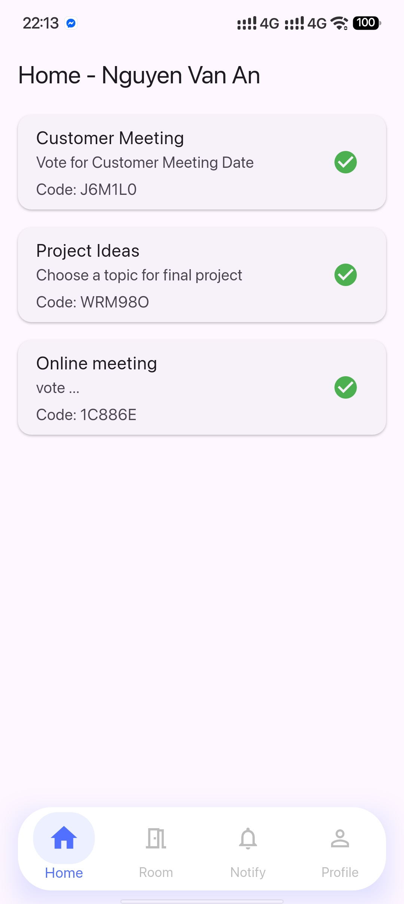
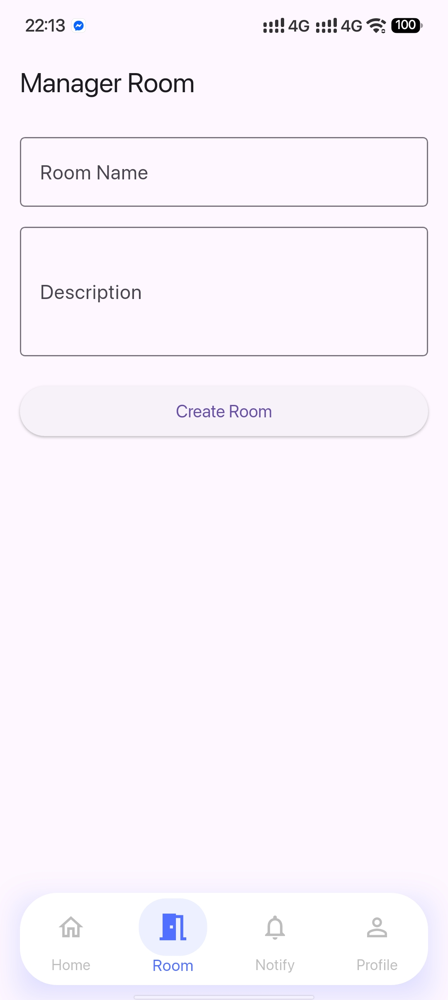
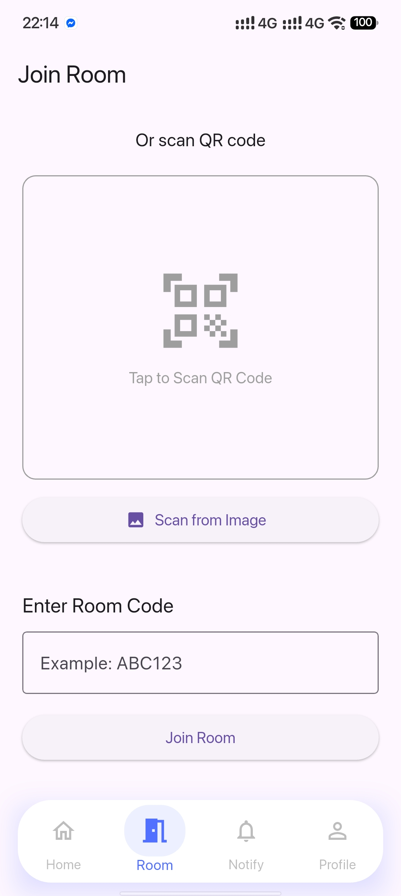

# E-Voting Mobile App (Flutter)

## Overview

E-Voting Mobile App is a secure and user-friendly mobile application built with **Flutter (Dart)** that enables digital voting in a controlled environment. The system supports multiple roles and leverages modern security concepts like **homomorphic encryption** to ensure vote privacy and integrity.

This app is designed for scenarios such as classrooms, organizations, or internal elections.

---

## Features

### Authentication

* User login with secure authentication (JWT-based backend)
* Persistent login state (without storing passwords)
* Role-based access control

### Voting System

* Join voting rooms via QR code scanning
* Cast votes securely
* Prevent duplicate voting
* Real-time voting updates (optional)

### Security

* Homomorphic encryption for vote confidentiality
* Votes remain encrypted even during counting
* Manager-controlled visibility of results

### Roles

#### Manager

* Create and manage voting rooms
* Add participants automatically (based on group)
* Control voting visibility (show/hide results)
* Monitor voting progress
* Update room details

#### Voter

* Join rooms via QR code
* Select and submit vote
* View voting status


---

## Tech Stack

* Flutter
* Dart
* Provider (State Management)
* Mobile Scanner (QR code scanning)
* AsyncStorage (persist auth state)


### Security & Cryptography

* Homomorphic Encryption (for vote privacy)
* HTTPS / TLS communication

---

## 📂 Project Structure

```
lib/
│── core/
│   ├── constants/
│   ├── storage/
│── features/
│   ├── announcement/
│   ├── auth/
│   ├── home/
│   ├── profile/
│   ├── manage/
│── models/
│── screens/
│── services/
│── widgets/
│── main.dart
```

---

## Screenshots 

<p align="center">
  
  
  
</p>

<p align="center">
  
  
  
</p>

<p align="center">
  
  
  
</p>

---

## Installation

### 1. Clone the repository

```bash
git clone https://github.com/uhphuc/E_voting_mobile_app.git
cd E_voting_mobile_app
```

### 2. Install dependencies

```bash
flutter pub get
```

### 3. Run the app

```bash
flutter run
```

---

## API Integration

* Authentication via JWT
* Secure endpoints for voting and room management
* Real-time updates (optional via WebSocket / Socket.IO)

---

## Future Improvements

* Push notifications (new voting room, results)
* Biometric authentication (FaceID / Fingerprint)
* Offline voting support
* Advanced analytics dashboard for managers

---

## License

This project is licensed under the MIT License.

---

## Author

* Ung Huynh Phuc

---

## Notes

* This project focuses on **security, scalability, and usability**
* Designed as part of a **mobile + cybersecurity learning project**

---
